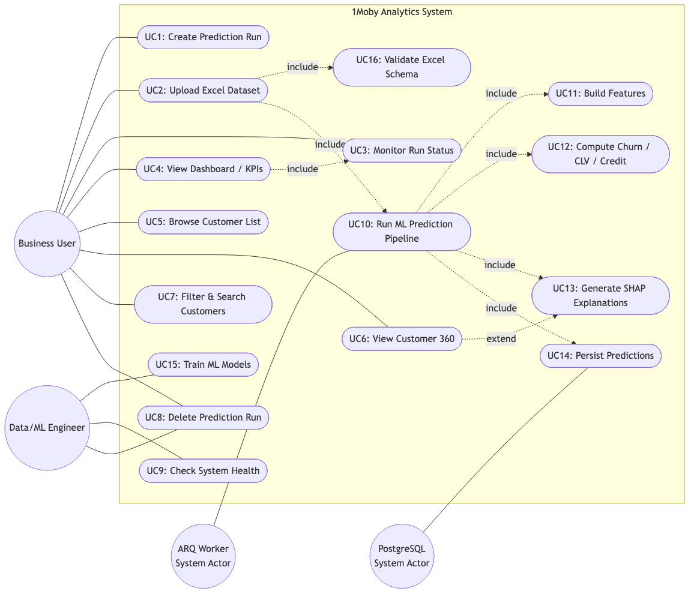
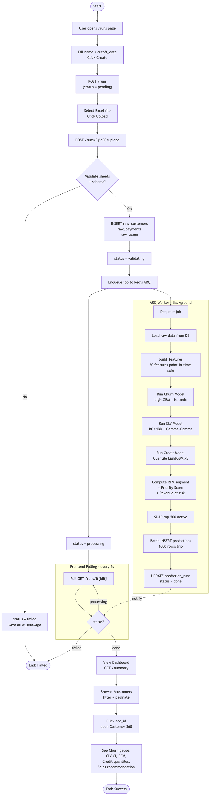
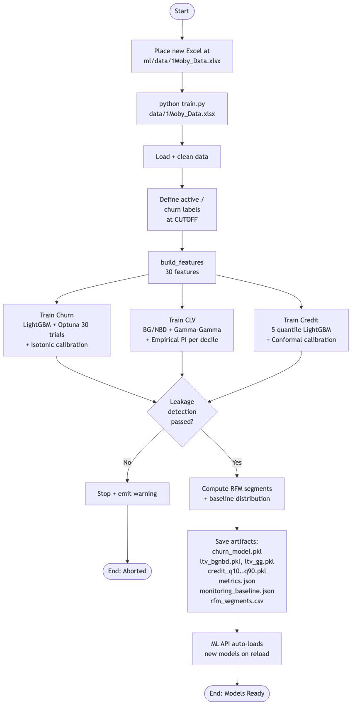

% 1Moby Analytics — Use Case & Activity Diagrams

# 1Moby Analytics — Use Case & Activity Diagrams

เอกสารนี้รวบรวม **Use Case Diagram** และ **Activity Diagrams** ของระบบ 1Moby Analytics
(อ้างอิงจาก README.md และ PROJECT.md)

---

## สารบัญ

- 1. Use Case Diagram
- 2. Use Case Descriptions
- 3. Activity Diagram — End-to-End Prediction Workflow
- 4. Activity Diagram — Model Training (Offline)

---

## 1. Use Case Diagram

---

## 2. Use Case Descriptions

| ID | Use Case | Actor(s) | Description | Trigger | Main Flow |
|----|----------|----------|-------------|---------|-----------|
| **UC1** | Create Prediction Run | Business User | สร้าง run ใหม่โดยตั้ง `name` และ `cutoff_date` เพื่อใช้เป็นจุดอ้างอิงการวิเคราะห์ | กดปุ่ม "Create Run" บนหน้า `/runs` | `POST /runs` → DB insert → run status = `pending` |
| **UC2** | Upload Excel Dataset | Business User | อัปโหลดไฟล์ Excel (Users, Payments, Usage) ให้ระบบประมวลผล | กด Upload หลังสร้าง run | Validate sheets → INSERT raw_* tables → enqueue ARQ job |
| **UC3** | Monitor Run Status | Business User | ติดตามสถานะ run แบบ real-time (`pending → validating → processing → done / failed`) | เปิดหน้า dashboard / runs | Poll ทุก 5s หรือ subscribe SSE `/runs/{id}/stream` |
| **UC4** | View Dashboard / KPIs | Business User | ดูภาพรวม: Active customers, Revenue at risk, Churn distribution, RFM, Urgency | เลือก run จาก dropdown | `GET /runs/{id}/summary` → render charts |
| **UC5** | Browse Customer List | Business User | ดูตารางลูกค้าทั้งหมดของ run พร้อม pagination | เปิดหน้า `/customers` | `GET /runs/{id}/predictions?page=...` |
| **UC6** | View Customer 360 | Business User | ดูรายละเอียดลูกค้ารายคน: Churn gauge, CLV+CI, RFM, Credit forecast, Sales recommendation | คลิก `acc_id` | `GET /runs/{id}/predictions/{acc_id}` |
| **UC7** | Filter & Search Customers | Business User | กรองตาม Churn tier / RFM segment / Urgency / search `acc_id` | เลือก filter | ส่ง query params ไป `/predictions` |
| **UC8** | Delete Prediction Run | Business User / Admin | ลบ run พร้อม cascade ลบ raw + predictions | กดปุ่ม Delete (confirmation) | `DELETE /runs/{id}` |
| **UC9** | Check System Health | Admin | ตรวจสถานะ DB connectivity + model files ที่โหลด | `GET /health` | คืน status + model versions |
| **UC10** | Run ML Prediction Pipeline | ARQ Worker (system) | ประมวลผล ML ทั้งหมดเป็น background job | ARQ dequeue job | load raw → features → predict → SHAP → batch insert |
| **UC11** | Build Features | Worker | สร้าง 30 features (user / payment / usage) แบบ point-in-time safe | ภายใน UC10 | `build_features(users, payments, usage, cutoff)` |
| **UC12** | Compute Churn / CLV / Credit | Worker | รัน 3 โมเดล: LightGBM (Churn), BG/NBD+GG (CLV), Quantile LGBM ×5 (Credit) | ภายใน UC10 | `MobyPredictor.run_all_predictions()` |
| **UC13** | Generate SHAP Explanations | Worker | คำนวณ top-3 risk factor สำหรับ active customer 500 อันดับแรก | ภายใน UC10 | SHAP TreeExplainer |
| **UC14** | Persist Predictions | Worker → DB | บันทึก predictions แบบ batch 1,000 rows/trip | ภายใน UC10 | INSERT INTO predictions |
| **UC15** | Train ML Models | Data/ML Engineer | retrain โมเดลด้วยข้อมูลใหม่ | manual CLI | `python train.py <excel>` → save `.pkl` ใน `models/` |
| **UC16** | Validate Excel Schema | System (during UC2) | ตรวจ sheets ที่จำเป็น และ schema ของแต่ละ sheet | ระหว่าง upload | reject ถ้า invalid → status = `failed` |

---

## 3. Activity Diagram — End-to-End Prediction Workflow

---

## 4. Activity Diagram — Model Training (Offline)

---

## Summary

- **UC1–UC9** → user-facing flows ผ่าน Next.js frontend
- **UC10–UC14** → automated system flows ที่ worker เรียกหลัง upload
- **UC15–UC16** → admin / system support
- End-to-end activity diagram แสดง async hand-off ผ่าน **Redis + ARQ worker** และ polling loop ทุก 5 วินาที ขณะ `status = processing`
- Training activity diagram แยกออกมาเป็น offline CLI ที่ผลิต `.pkl` artifacts ให้ API/Worker โหลดตอน runtime
