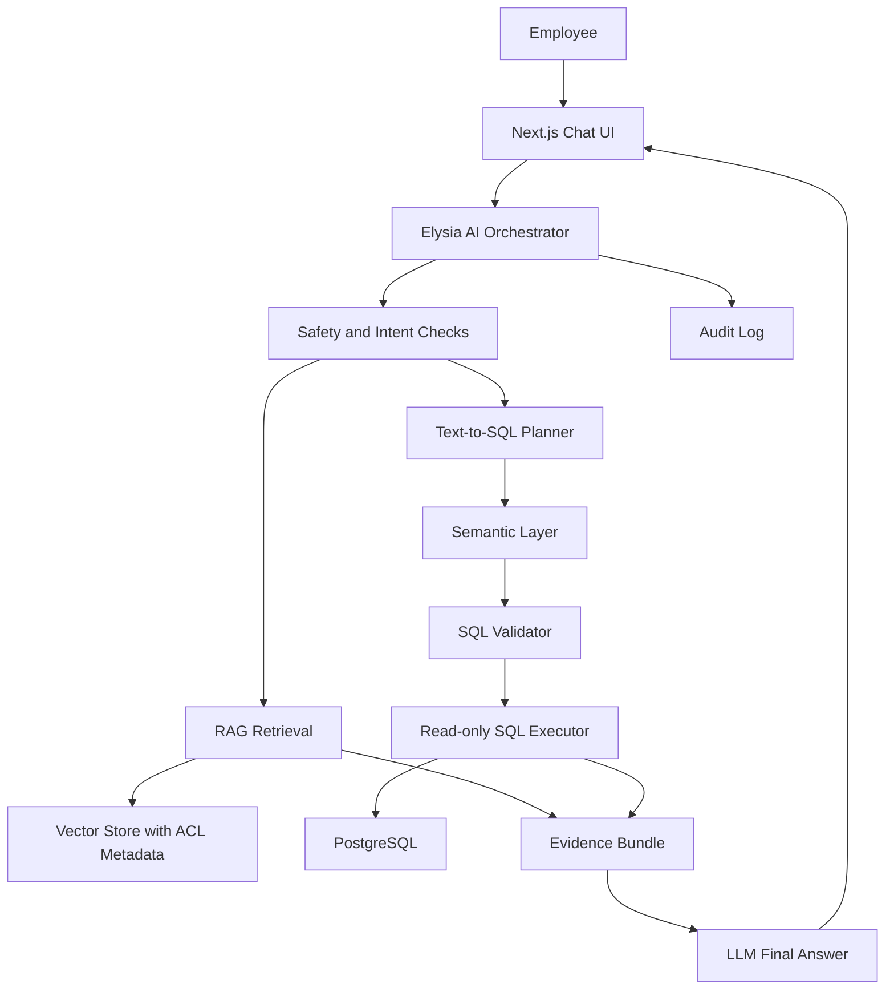

# Moby AI Assistant Architecture

This document defines the target architecture for Moby AI as an internal company assistant.
The goal is broad natural-language access while keeping data access governed, auditable, and grounded.

## Product Goal

Moby AI should answer two classes of questions:

- Company knowledge: definitions, SOPs, product facts, metric meanings, workflow guidance.
- Analytics data: ad hoc questions over approved PostgreSQL tables using governed Text-to-SQL.

The user should feel free to ask broadly. The model should not be free to bypass permissions, invent metrics, or run arbitrary database operations.

## Architecture

## Key Components

### 1. AI Orchestrator

The orchestrator owns the workflow. The LLM should not directly talk to databases or vector stores.

Required workflow:

1. Normalize and limit conversation history.
2. Run safety checks on the latest question.
3. Retrieve relevant company knowledge when useful.
4. Generate SQL only from the semantic layer.
5. Validate SQL before execution.
6. Execute in a read-only transaction with timeout and row limits.
7. Ask the LLM to answer only from evidence.
8. Return answer, sources, SQL metadata, warnings, and audit data.

### 2. RAG Knowledge Base

RAG is for company knowledge, not for raw database analytics.

Store documents as chunks:

- `document_id`
- `chunk_id`
- `source_uri`
- `title`
- `section`
- `content`
- `content_hash`
- `embedding`
- `classification`
- `allowed_roles`
- `owner_user_id`
- `updated_at`

The model must not read every document every round. It should read only top relevant chunks.

Recommended defaults:

- Chunk size: 400-800 tokens.
- Retrieval: top 20 candidates.
- Rerank: top 3-5 final chunks.
- Final context budget: 2,000-4,000 tokens for RAG evidence.
- Use citations in every answer that relies on company knowledge.

This controls token cost because the LLM sees only the small evidence bundle, not the whole knowledge base.

### 3. Embeddings

Embeddings convert document chunks into vectors for semantic search.

Recommended path for this repo:

1. Start with PostgreSQL + `pgvector`.
2. Add a document ingestion script.
3. Store metadata and ACLs beside every chunk.
4. Re-embed only documents whose `content_hash` changed.

Embedding is done when documents are ingested or updated, not on every answer. Each user question is embedded once for retrieval.

### 4. Semantic Layer

The semantic layer is the contract between business language and SQL.

It must define:

- Allowed tables/views.
- Allowed columns.
- Business meanings.
- Metric definitions.
- Join paths.
- Time grain rules.
- Default filters.
- Role requirements.
- Examples of Thai questions and approved SQL patterns.

Production-grade Text-to-SQL should prefer modeled views or semantic metrics over raw tables. Accuracy comes from preventing invalid SQL before generation, not only catching it after.

### 5. Text-to-SQL

Text-to-SQL converts Thai questions into PostgreSQL `SELECT` statements.

Rules:

- The LLM can generate SQL only from the semantic layer.
- SQL is never executed until it passes validation.
- SQL results become evidence for the final answer.
- The final answer must not add facts that are not in the evidence.

Failure behavior:

- If SQL validation fails, fail closed or ask the model to repair once using the validator error.
- If the schema cannot answer the question, say what data is missing.
- If result rows are empty, say no matching rows were found.

### 6. SQL Validator

The validator must be deterministic code, not an LLM judgment.

Minimum checks:

- Allow only one `SELECT` statement.
- Block `INSERT`, `UPDATE`, `DELETE`, `DROP`, `ALTER`, `TRUNCATE`, `COPY`, `EXECUTE`, `CALL`.
- Block `SELECT *`.
- Allow only modeled tables and columns.
- Enforce role-based table and column access.
- Enforce `LIMIT`.
- Cap maximum rows.
- Run with statement timeout.
- Execute through a read-only database user or read-only transaction.

Future checks:

- Use a SQL parser AST instead of regex checks.
- Add cost estimation with `EXPLAIN` before execution.
- Add approved query templates for critical KPIs.
- Add one repair attempt when validation fails.

### 7. Permission Model

Permissions must be enforced inside retrieval and SQL execution, not only in the UI.

Suggested roles:

- `viewer`: system status and aggregated summaries.
- `analyst`: customer analytics and prediction outputs.
- `admin`: audit, config, and operational diagnostics.

Sensitive fields should be omitted from the semantic layer unless explicitly needed. PII should be redacted before sending evidence to any hosted LLM.

### 8. Audit Log

Every AI request should produce an audit event.

Store:

- `user_id`
- `question`
- `mode`
- `model`
- `retrieved_sources`
- `generated_sql`
- `validation_result`
- `row_count`
- `warnings`
- `latency_ms`
- `created_at`

This is required for debugging, compliance, cost control, and trust.

### 9. Prompt Injection Defense

RAG content is untrusted data. User messages are untrusted data.

Defenses:

- Detect prompt-injection patterns in user questions.
- Strip instruction-like text from retrieved chunks.
- Wrap evidence in clear delimiters.
- Repeat that evidence is data, not instructions.
- Never reveal system prompts or hidden policies.
- Do not let retrieved documents define tool permissions.

### 10. Evaluation

Before broad release, build a golden test set:

- Thai business questions.
- Known-good SQL.
- Expected answer shape.
- Permission-denied cases.
- Prompt-injection cases.
- Empty-result cases.
- High-risk metric questions such as churn, CLV, revenue at risk.

Track:

- SQL validity.
- Execution success.
- Semantic correctness.
- Row count and latency.
- Hallucination rate.
- Permission violations.

## Implementation Phases

### Phase 1: Current MVP

- Text-to-SQL planner.
- Semantic table allowlist.
- SQL validator.
- Read-only executor.
- Lightweight knowledge search hook.
- Evidence metadata in the UI.

### Phase 2: Production Hardening

- Add audit tables through Alembic.
- Add SQL parser validation.
- Add LLM retry-on-validation-error.
- Add EXPLAIN/cost gate.
- Add real role lookup instead of `AI_CHAT_DEFAULT_ROLE`.
- Add redaction for PII and long text values.

### Phase 3: Real RAG

- Add `pgvector`.
- Add knowledge document/chunk tables.
- Add ingestion script for `docs/company-knowledge`.
- Add retrieval-time ACL filtering.
- Add citation rendering in the UI.

### Phase 4: BI UX

- Add chart suggestions from result shape.
- Save approved questions.
- Add scheduled reports.
- Add feedback buttons.
- Store verified NL-SQL pairs for retrieval examples.

## Non-Negotiables

- No arbitrary SQL execution.
- No write operations from AI.
- No hidden prompt disclosure.
- No unrestricted document retrieval.
- No answer without evidence for analytics.
- No metric definitions outside the semantic layer.
