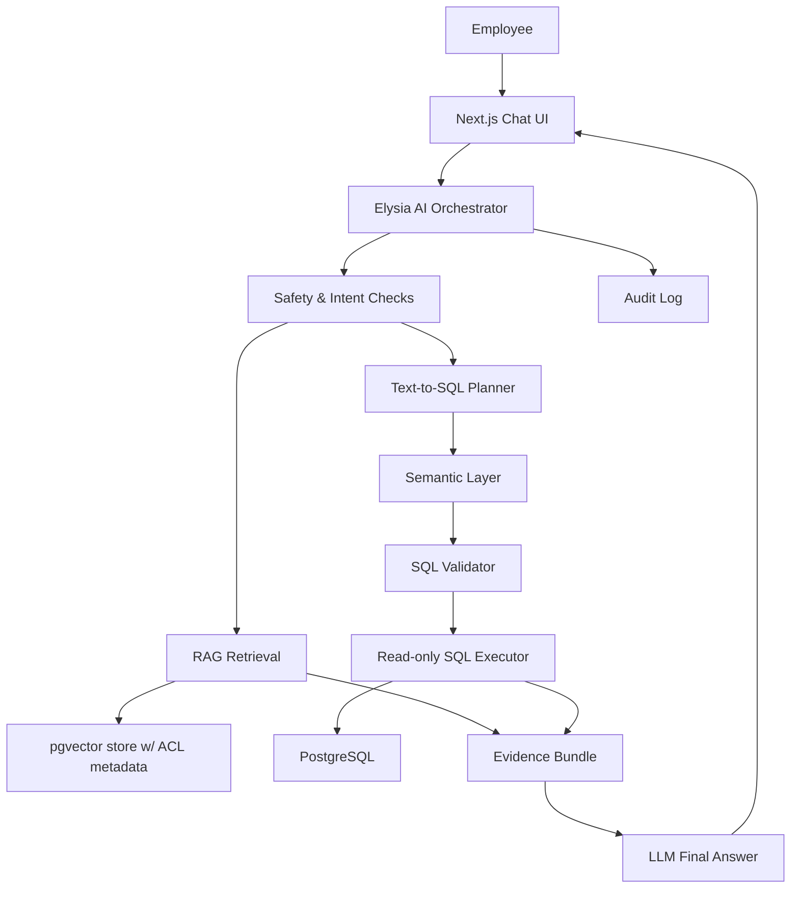

# AI Assistant — Architecture & Build Plan

Moby AI is an internal company assistant for 1Moby. This document is the single source of truth for
its design: the target architecture and governance principles, plus the concrete v2 build that replaces
the original brittle chat path.

> Consolidates the former `AI-ASSISTANT-ARCHITECTURE.md` (principles) and `AI-CHAT-V2-PLAN.md`
> (approved build). Status: **building**.

## 1. Goal

Moby AI answers two classes of questions while keeping data access governed, auditable, and grounded:

- **Company knowledge** — definitions, SOPs, product facts, metric meanings, workflow guidance.
- **Analytics data** — ad hoc questions over approved PostgreSQL tables via governed Text-to-SQL,
  plus per-account investigation.

Users may ask broadly. The model may **not** bypass permissions, invent metrics, or run arbitrary
database operations.

## 2. Locked decisions

| Topic | Decision |
|---|---|
| **LLM** | **Ollama Cloud** (`qwen3.5:397b-cloud`) for chat; an Ollama embedding model for RAG |
| **Capabilities** | 3 core only: (1) Text-to-SQL over prediction data, (2) per-account investigation, (3) company/ML knowledge Q&A. No separate action/chart/export feature — insights surface inside answers via `priority_reason` / `churn_factors_json`. |
| **RAG** | **Real vector RAG** via **pgvector** (not keyword), with inline source citations |
| **Streaming** | Yes — token-by-token via SSE |
| **History** | Full Postgres persistence — multi-conversation, sidebar, rename/delete |
| **Knowledge ingestion** | Auto-ingest existing docs on first boot + admin upload page |
| **Conversations** | Per-user private (not shared across the ~5 internal users) |

## 3. Architecture



```
Browser (Next.js :3000)
  │  REST: conversations CRUD, knowledge admin
  │  SSE:  POST /ai-chat/conversations/:id/messages → token stream
  ▼
Elysia :3001
  ├─ ai-chat routes (conversations, messages, knowledge)
  ├─ orchestrator (tool-calling loop)
  │     ├─ tool: query_database   → semantic-layer + sql-guard + sql-executor
  │     ├─ tool: get_customer     → per-account evidence query
  │     └─ tool: search_knowledge → pgvector cosine retrieval
  ├─ Ollama Cloud (chat: qwen3.5:397b-cloud, stream=true, tools)
  └─ Ollama Cloud (embed)
  ▼
PostgreSQL 15 + pgvector
  ai_conversations, ai_messages, ai_knowledge_documents, ai_knowledge_chunks(embedding)
  + ml_prediction_outputs / predict_clean_* (read-only via SQL tool)
```

### Orchestration: agentic tool-calling, with router fallback

The LLM never talks directly to the database or vector store. The orchestrator owns the workflow:

1. Normalize and limit conversation history.
2. Run safety checks on the latest question.
3. The model is given three tools and decides which to call (zero, one, or several):
   - `query_database(question)` — NL analytics → validated SQL → rows
   - `get_customer(acc_id)` — full evidence bundle for one account
   - `search_knowledge(query)` — top-k semantic chunks
4. Synthesize a grounded answer from evidence only.
5. Return answer + sources + SQL metadata + warnings + audit data.

Every tool result is attached to the message as **evidence** (SQL run, rows read, sources cited) so
answers are auditable and never hallucinated. If `qwen3.5:397b-cloud` tool-calling proves unreliable,
fall back to a deterministic intent router using the same tool functions — no rework of the tools.

## 4. Key components

### Semantic layer — the contract between business language and SQL
Defines allowed tables/views, allowed columns, business meanings, metric definitions, join paths,
time-grain rules, default filters, role requirements, and example Thai questions → approved SQL.
Production Text-to-SQL prefers modeled views/metrics over raw tables — accuracy comes from preventing
invalid SQL before generation, not only catching it after.

### Text-to-SQL
Converts Thai questions into PostgreSQL `SELECT` statements. The LLM may generate SQL only from the
semantic layer; SQL is never executed until it passes validation; results become evidence; the final
answer adds no facts beyond the evidence. On validation failure: fail closed or repair once using the
validator error. If the schema can't answer, say what data is missing. If rows are empty, say so.

### SQL validator (deterministic code, not LLM judgment)
Minimum checks: allow a single `SELECT` only; block `INSERT/UPDATE/DELETE/DROP/ALTER/TRUNCATE/COPY/
EXECUTE/CALL`; block `SELECT *`; allow only modeled tables/columns; enforce role-based access; enforce
`LIMIT`; cap rows; statement timeout; execute via a read-only user/transaction.
*Future:* SQL parser AST instead of regex, `EXPLAIN` cost gate, approved templates for critical KPIs.

### RAG knowledge base + embeddings
RAG is for company knowledge, not raw analytics. Pipeline:
1. **Chunk** source docs into ~500-token chunks (overlap).
2. **Embed** each chunk via Ollama `/api/embed`; store the vector.
3. **Retrieve** by embedding the query, `ORDER BY embedding <=> $query LIMIT k` (cosine).
4. **Ground** — top-k chunks injected into the prompt; sources cited back to the user.

Defaults: retrieval top ~20 → rerank to 3–5 final chunks → 2,000–4,000 token RAG budget. Re-embed only
documents whose `content_hash` changed. Initial sources auto-ingested on first boot: `docs/ML-V2-*.md`,
`docs/AI-ASSISTANT.md`, and the metric definitions currently hardcoded in the old `company-knowledge.ts`.

### Permissions, audit, injection defense
- **Permissions** enforced in retrieval and SQL execution, not only the UI. Suggested roles: `viewer`
  (status + aggregates), `analyst` (customer analytics + predictions), `admin` (audit + config). PII
  redacted before sending evidence to any hosted LLM.
- **Audit** — every request writes `user_id, question, mode, model, retrieved_sources, generated_sql,
  validation_result, row_count, warnings, latency_ms, created_at`.
- **Prompt-injection defense** — treat user messages and retrieved chunks as untrusted data: detect
  injection patterns, strip instruction-like text from chunks, wrap evidence in delimiters, never reveal
  system prompts, never let retrieved docs define tool permissions.

### Evaluation
Before broad release, build a golden test set (Thai business questions, known-good SQL, expected answer
shape, permission-denied / injection / empty-result cases, high-risk metrics like churn/CLV/revenue-at-
risk). Track SQL validity, execution success, semantic correctness, row count, latency, hallucination
rate, permission violations.

## 5. Database

Current schema (`db/init/001_schema.sql`) already has the conversation tables; the knowledge/vector
tables are the next step.

```sql
CREATE EXTENSION IF NOT EXISTS vector;   -- pgvector image is in use; extension enabled with knowledge tables

-- Conversations & messages (LIVE today)
CREATE TABLE IF NOT EXISTS public.ai_conversations (
    id         uuid PRIMARY KEY DEFAULT gen_random_uuid(),
    user_id    text NOT NULL REFERENCES public."user"(id) ON DELETE CASCADE,
    run_id     uuid REFERENCES public.ml_prediction_runs(id) ON DELETE SET NULL,
    title      text NOT NULL DEFAULT 'New chat',
    archived   boolean NOT NULL DEFAULT false,
    created_at timestamptz NOT NULL DEFAULT now(),
    updated_at timestamptz NOT NULL DEFAULT now()
);

CREATE TABLE IF NOT EXISTS public.ai_messages (
    id              bigint GENERATED ALWAYS AS IDENTITY PRIMARY KEY,
    conversation_id uuid NOT NULL REFERENCES public.ai_conversations(id) ON DELETE CASCADE,
    role            text NOT NULL CHECK (role IN ('user','assistant')),
    content         text NOT NULL,
    evidence_json   jsonb,          -- sql, rows_read, sources, warnings
    model           text,
    created_at      timestamptz NOT NULL DEFAULT now()
);
CREATE INDEX IF NOT EXISTS ai_messages_conv_idx ON public.ai_messages(conversation_id, id);

-- Knowledge base (PLANNED — add when RAG lands)
CREATE TABLE IF NOT EXISTS public.ai_knowledge_documents (
    id          uuid PRIMARY KEY DEFAULT gen_random_uuid(),
    title       text NOT NULL,
    source      text NOT NULL,      -- file path or 'upload'
    uploaded_by text REFERENCES public."user"(id) ON DELETE SET NULL,
    created_at  timestamptz NOT NULL DEFAULT now()
);

CREATE TABLE IF NOT EXISTS public.ai_knowledge_chunks (
    id          bigint GENERATED ALWAYS AS IDENTITY PRIMARY KEY,
    document_id uuid NOT NULL REFERENCES public.ai_knowledge_documents(id) ON DELETE CASCADE,
    chunk_index int NOT NULL,
    content     text NOT NULL,
    embedding   vector(768),        -- embeddinggemma / nomic-embed-text = 768
    created_at  timestamptz NOT NULL DEFAULT now()
);
CREATE INDEX IF NOT EXISTS ai_knowledge_chunks_embed_idx
    ON public.ai_knowledge_chunks USING hnsw (embedding vector_cosine_ops);
```

Schema changes go straight into `db/init/001_schema.sql` (the dev volume is disposable — reinit with
`docker compose down -v`). No standalone migration framework.

## 6. API routes (Elysia, all under `requireUser`, scoped by `userId`)

```
GET    /ai-chat/conversations                 list (sidebar)
POST   /ai-chat/conversations                 create
GET    /ai-chat/conversations/:id             get + messages
PATCH  /ai-chat/conversations/:id             rename / archive
DELETE /ai-chat/conversations/:id             delete (cascade messages)
POST   /ai-chat/conversations/:id/messages    send user msg → SSE token stream (persists msg + evidence)

GET    /ai-chat/knowledge                     list documents (admin)
POST   /ai-chat/knowledge                     upload doc → ingest (admin)
DELETE /ai-chat/knowledge/:id                 remove doc + chunks (admin)
POST   /ai-chat/knowledge/reindex             rebuild embeddings (admin)
```

The first user message generates a short conversation title. Knowledge upload is admin-only.

## 7. Streaming

`POST /ai-chat/conversations/:id/messages` returns `text/event-stream`. The orchestrator emits SSE
events (`thinking`, `token`, `evidence`, `done`, `error`); Ollama chat is called with `stream: true`.
On completion the full assistant message + evidence is persisted and a final `done` event carries the
evidence payload + message id. The frontend renders tokens live, then swaps in the evidence panel.

## 8. Frontend

- **Sidebar** — conversation list, new chat, rename, delete, active highlight.
- **Stream render** — assistant bubble fills token-by-token; typing indicator.
- **Evidence panel** — collapsible: SQL used, rows read, knowledge sources, warnings.
- **Admin knowledge page** — upload, list, delete, reindex (admin role only).
- `chatStore.ts` is built around the persistent API + SSE.

Align with ML v2: no quick links to the removed `/playbooks` page; quick prompts ask questions that are
actually answerable from `ml_prediction_outputs` (e.g. "high-risk customers with CLV over 10k").

## 9. Build phases & status

| Phase | Work | Status |
|---|---|---|
| Conversations + messages persistence | `ai_conversations` / `ai_messages` + CRUD | done (schema live) |
| Orchestrator (tool-calling loop) | reuse SQL safety + account query | building |
| Streaming | SSE message endpoint, persist evidence | building |
| REST routes | conversations CRUD + knowledge admin | building |
| Frontend | sidebar, streaming, evidence panel | building |
| RAG | enable `vector` extension, knowledge tables, embed, chunk, ingest, retrieval | planned |
| Verification | `verify_ai_chat`: schema present, embeddings round-trip, SQL guard blocks writes, SSE streams, history persists | planned |

## 10. Migration / rollout notes

- `db/init/*` only runs on a **fresh** Postgres volume. To add new tables to an existing dev volume,
  apply the SQL once manually or `docker compose down -v` to reinit (destroys data).
- Env: `OLLAMA_API_KEY`, `OLLAMA_HOST`, `OLLAMA_MODEL`, `OLLAMA_EMBED_MODEL` (default `embeddinggemma`,
  768-dim), `AI_RAG_TOP_K` (default 5).
- No change to the ML pipeline, training, or existing prediction tables.

## Non-negotiables

- No arbitrary SQL execution. No write operations from AI.
- No hidden prompt disclosure. No unrestricted document retrieval.
- No answer without evidence for analytics. No metric definitions outside the semantic layer.
