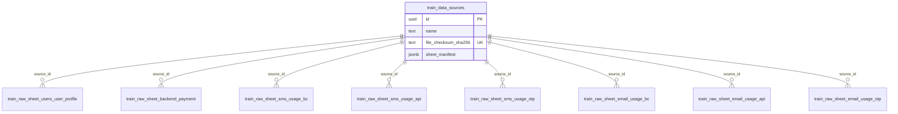

# Train raw data schema

PostgreSQL tables for **training** data only — faithful Excel imports (`train_raw_sheet_*`).

Predict and clean use other families: [naming-convention.md](naming-convention.md).

## Entity relationship



## `train_data_sources`

Catalog: one uploaded training `.xlsx` per row.

| Column | Type | Description |
|--------|------|-------------|
| `id` | uuid | Primary key |
| `name` | text | Display name |
| `client_label` | text | e.g. `bangkok_university` |
| `original_filename` | text | Basename of file |
| `file_checksum_sha256` | text | Unique — blocks re-import |
| `file_size_bytes` | bigint | |
| `import_status` | text | `pending` / `importing` / `ready` / `failed` |
| `imported_at` | timestamptz | |
| `sheet_manifest` | jsonb | Inserted row counts per sheet name |
| `notes` | text | |
| `error_message` | text | |

## `train_raw_sheet_*` (shared shape)

| Column | Type | Description |
|--------|------|-------------|
| `id` | bigserial | PK |
| `source_id` | uuid | FK → `train_data_sources.id` CASCADE |
| `excel_row` | integer | 1-based row in sheet (row 1 = header) |
| `row_payload` | jsonb | Cells keyed by trimmed Excel header |
| `imported_at` | timestamptz | |

No UNIQUE on business keys.

### Table ↔ Excel sheet

| PostgreSQL table | Excel sheet |
|------------------|-------------|
| `train_raw_sheet_users_user_profile` | `Users+User_profile` |
| `train_raw_sheet_backend_payment` | `Backend_payment` |
| `train_raw_sheet_sms_usage_bc` | `SMS_usage (BC)` |
| `train_raw_sheet_sms_usage_api` | `SMS_usage (API)` |
| `train_raw_sheet_sms_usage_otp` | `SMS_usage (OTP)` |
| `train_raw_sheet_email_usage_bc` | `Email_usage (BC)` |
| `train_raw_sheet_email_usage_api` | `Email_usage (API)` |
| `train_raw_sheet_email_usage_otp` | `Email_usage (OTP)` |

DDL: [`db/init/001_schema.sql`](../../db/init/001_schema.sql)

## Example `row_payload`

**Users+User_profile:**

```json
{
  "acc_id": 23,
  "status (SMS)": "PAID",
  "user.credit + user.credit_premium": 23466015,
  "credit_email": 2000,
  "expire": 47574,
  "expire_email": 46086,
  "status (Email)": "TRIAL",
  "join_date": 39869,
  "last_access": 46055.317928240744,
  "last_send": 46082
}
```

## Later layers

| Family | When |
|--------|------|
| `predict_data_sources` + `predict_raw_sheet_*` | Per-run / inference uploads |
| `train_clean_runs` + `train_clean_*` | ETL from train raw |
| `predict_clean_*` | ETL from predict raw |
